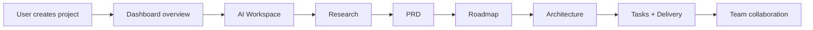
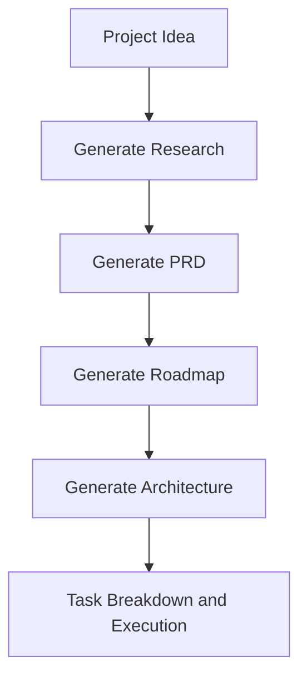
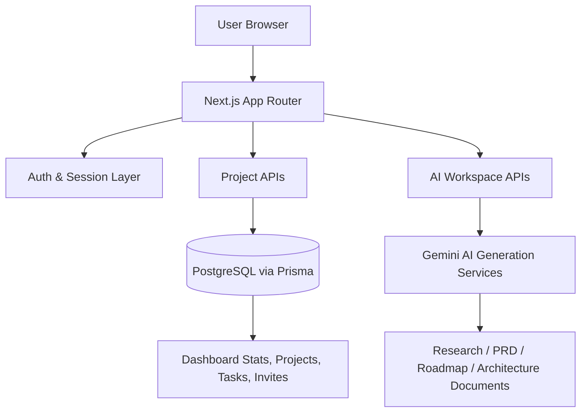
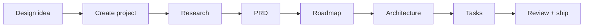

<h1 align="center">Builder OS</h1>

<p align="center">
  
  
  
  
  
</p>

<p align="center">
  <a href="#installation"></a>
  <a href="#workflow-example"></a>
  <a href="#tech-stack"></a>
</p>

<p align="center">
  Builder OS is an AI-native workspace for turning ambitious ideas into structured product outcomes. It helps teams move from discovery and research to PRDs, roadmaps, architecture, execution, and collaboration through one intelligent workflow.
</p>

> Builder OS brings strategy, planning, and delivery together in a single unified workspace for modern product teams.

## Why Builder OS

Builder OS turns a product idea into a working delivery system by combining:

<p align="center">
  
  
  
  
</p>

- AI-assisted research and product discovery
- Product requirements document generation
- Roadmap planning
- Technical architecture generation
- Project and task management
- Team collaboration with invitations and membership roles
- Real-time dashboard analytics and activity tracking

## Product Workflow



## Core AI Pipeline



## System Architecture



## Tech Stack

- Next.js 16
- React 19
- TypeScript
- Prisma ORM
- PostgreSQL
- NextAuth
- Gemini AI model integration
- Tailwind CSS
- Radix UI + shadcn-style primitives
- Resend for email delivery
- Mermaid rendering for architecture diagrams and docs

## Monorepo-Style Structure

```text
app/                   # App Router pages and API routes
components/            # UI components for landing, dashboard, tasks, AI workspace and architecture
hooks/                 # Reusable client hooks
lib/                   # Auth, AI prompt builders, Mermaid utilities, prisma client
prisma/                # Database schema and migrations
services/              # Service layer for auth, API, project and AI operations
store/                 # Redux slices and global state
types/                 # Shared TS interfaces
public/                # Static assets
```

## Main Features

### 1. Project-based workspaces
Create, update, and organize products with status, color tagging, and collaboration members.

### 2. AI asset generation
Generate the following artifacts from prompt-driven workflows:

- Research
- PRD
- Roadmap
- Architecture
- Documents

### 3. Collaboration
Invite teammates, manage project memberships, and send onboarding emails through a secure project flow.

### 4. Dashboard intelligence
Track project counts, task states, AI request volume, and overall completion percentage in real time.

### 5. Visual docs and diagrams
Use Mermaid-based architecture rendering and structured roadmap outputs for better team comprehension.

## Installation

<p align="center">
  
  
  
</p>

1. Clone the repository.
2. Install dependencies:

```bash
npm install
```

3. Configure your environment variables in a `.env` file.

### Required environment variables

```env
DATABASE_URL=postgresql://... 
NEXTAUTH_SECRET=your-secret
NEXTAUTH_URL=http://localhost:3000
GOOGLE_API_KEY=your-gemini-key
RESEND_API_KEY=your-resend-key
```

## Database Setup

Generate Prisma client and run migrations:

```bash
npx prisma generate
npx prisma migrate dev
```

## Run the Application

### Development

```bash
npm run dev
```

### Production build

```bash
npm run build
npm run start
```

### Linting

```bash
npm run lint
```

## Workflow Example

A typical Builder OS session looks like this:

1. Create a new project.
2. Open the AI workspace.
3. Ask for market, customer, or technical research.
4. Convert that research into a PRD.
5. Generate a roadmap from the PRD.
6. Build a system architecture and review Mermaid output.
7. Track execution through tasks and dashboard metrics.

## API and App Layer Notes

The repository uses the App Router and exposes application logic through route handlers such as:

- `/api/ai/*`
- `/api/projects/*`
- `/api/dashboard/*`
- `/api/auth/*`
- `/api/invitations/*`

These APIs coordinate database persistence, AI generation, and the UI state that powers the dashboard and project pages.

## Recommended Development Flow



## Contribution

Contributions are welcome. If you extend the AI generation pipeline or improve the app experience, keep changes aligned with the existing project abstractions:

- Keep prompts and generation services isolated in `lib/ai`
- Keep route logic under `app/api`
- Keep page-level UI under `app/` and reusable UI under `components/`
- Make schema changes through Prisma and migration files

## License

This project is currently structured as an internal product workspace. Please confirm your own licensing and deployment policy before production use.

