# Architecture Overview

AuraFit AI is architected as an edge-cloud hybrid platform designed for low-latency physical coaching, multimodal bio-telemetry processing, and real-time biometric adaptations. The system splits computation between high-performance local edge runtime on iOS (handling camera frame ingestion, 30 FPS spatial pose keypoint extraction, and WebRTC speech streaming) and a cloud platform running on AWS EKS (handling biometrics ingestion, fatigue modeling, vision-LLM orchestration, vector similarity search, and relational storage).

```
+-----------------------------------------------------------------------------------+
|                                AURAFIT AI PLATFORM                                |
|                                                                                   |
|  +-----------------------------------+     +-----------------------------------+  |
|  |           EDGE RUNTIME            |     |           CLOUD RUNTIME           |  |
|  |  (iOS Swift / CoreML / SwiftData) |     | (Go Microservices / AWS EKS / DB) |  |
|  |                                   |     |                                   |  |
|  |  - 30 FPS MediaPipe Pose Extr.    |     |  - Readiness & Fatigue Engine     |  |
|  |  - Joint Angle Calculations       |<--->|  - Multimodal Vision LLM Pipeline |  |
|  |  - SwiftData Offline Sync Queue   | HTTP|  - pgvector Context Retrieval     |  |
|  |  - WebRTC Audio Stream Client     | WSS |  - Wearable Normalization Pipeline|  |
|  +-----------------------------------+     +-----------------------------------+  |
+-----------------------------------------------------------------------------------+
```

### Core Architecture Principles
1. **Edge-First Computer Vision:** Heavy camera frame processing is constrained entirely to local mobile hardware using CoreML and Apple Vision / MediaPipe frameworks. Raw video frames are processed locally and discarded immediately. Only lightweight 3D coordinate spatial vectors are computed locally, maintaining a 33ms/frame budget, zero network bandwidth overhead, and complete privacy.
2. **Sub-600ms Speech-to-Speech Engine:** Intra-workout voice interactions stream compressed audio over WebSockets/WebRTC directly to an AI voice gateway. The cloud layer leverages prompt caching, stream-passthrough, and edge-deployed models to ensure voice roundtrip responses complete within 600ms.
3. **Normalized Telemetry Pipeline:** Biometric inputs from Apple HealthKit, Garmin, Oura, and Whoop enter through an ingestion layer that maps heterogeneous third-party schemas into a standardized biometric telemetry format before feeding the fatigue calculation engine.
4. **Resilient Offline Synchronization:** Native clients use an append-only transaction store (SwiftData/SQLite). Workouts, set logs, and form flaws are stored locally and reconciled asynchronously with the cloud database using deterministic vector clock sync protocols.

---

# Executive Summary

### Goal
AuraFit AI provides hyper-personalized, adaptive fitness and nutrition guidance by processing physiological telemetry, visual exercise execution, and multimodal dietary inputs. The platform adapts training schedules in real-time based on biometric fatigue, flags improper exercise form within 300ms, and parses meal photographs into macros within 2.5 seconds.

### Target Users
* **Data-Driven Athletes & Gym Enthusiasts:** Users who wear biometrics hardware (Apple Watch, Oura, Whoop, Garmin) and desire real-time adaptation without manual program tweaking.
* **GLP-1 Weight Management Patients:** Users requiring strict muscle retention protocols, structured high-protein tracking ($> 1.6\text{g/kg/day}$), and automated nutrient density safeguards.
* **Busy Professionals:** Users needing rapid, photo-based macro logging and automated daily training adaptations based on real sleep and recovery metrics.

### Business Value
* **Target Scale:** 50,000 active paid subscribers within 12 months at $14.99/month, targeting $8.99M ARR.
* **High Gross Margins ($\ge 80\%$):** Achieved by moving 100% of video processing to on-device hardware (avoiding cloud video ingestion bills) and utilizing prompt caching and fine-tuned Small Language Models (SLMs) for routine adjustments.
* **Retention Strategy:** Automated morning readiness recalibration creates a daily usage loop, reducing monthly churn below 4.5% and targeting a 30-day retention rate above 45%.

### Technical Vision
Build an extensible, enterprise-grade architecture that adheres to HIPAA and GDPR compliance boundaries, maintains 99.9% uptime, scales horizontally to support 100,000 Concurrent Active Users (CAU), and leverages hybrid edge-cloud paradigms to optimize compute cost and operational latency.

---

# Functional Requirements

### 1. Wearable Telemetry Ingestion & Normalization
* The system shall ingest biometric health data from Apple HealthKit, Google Health Connect, Garmin Connect API, Oura Cloud API, and Whoop API.
* Ingested telemetry must normalize heart rate variability (HRV), resting heart rate (RHR), sleep stage breakdown, active energy burn, and daily strain into a unified domain entity.
* Missing telemetry must automatically trigger an interactive 3-question morning recovery survey fallback.

### 2. Daily Readiness & Dynamic Workout Engine
* The system shall execute a daily fatigue calculation algorithm generating a 0–100% Readiness Score every morning upon user wake-up.
* If a user's Readiness Score drops below 45%, the system must automatically adjust the scheduled workout, reducing volume/intensity or swapping compound movements for active recovery sessions.
* The system must allow real-time intra-workout adjustments via voice commands ("Too heavy", "Swap exercise").

### 3. On-Device Computer Vision Form Correction
* The native app shall capture 1080p video frames at 30 FPS and perform real-time keypoint extraction on local hardware.
* The application must calculate spatial vectors across major joints (e.g., knee, hip, ankle, spine, shoulder) to detect biomechanical flaws (e.g., knee valgus, lumbar flexion).
* The application shall render a real-time HUD skeletal overlay and trigger localized audio cues when form violations occur within $< 300\text{ms}$.

### 4. Multimodal Photo-to-Macro Nutrition
* The system shall accept food photographs, passing them through a multimodal vision pipeline to identify meal components, estimate portion weights, and return macronutrient breakdowns (Protein, Carbs, Fats, Calories).
* The engine must use a multi-tiered lookup system: Semantic Redis vector cache $\rightarrow$ Vision LLM inference $\rightarrow$ USDA/Proprietary Database verification.
* Users must be able to edit component weights and confirm macro logs to their diary.

### 5. GLP-1 High-Protein Companion Mode
* The system shall support a GLP-1 dynamic mode that sets adaptive minimum protein thresholds ($1.6\text{g} - 2.2\text{g}$ per kg of body mass) and alerts users when daily protein intake falls behind schedule.
* The system must monitor 14-day chronic load vs. acute training load ratios to issue overuse injury warnings.

---

# Non-Functional Requirements

### Performance
* **CV Inference Frame Rate:** $\ge 30\text{ FPS}$ keypoint inference on Apple A14 Bionic / Snapdragon 8 Gen 1 hardware ($\le 33\text{ms}$ per frame).
* **Form Feedback Latency:** Visual HUD alert and audio cues delivered within $< 300\text{ms}$ of joint angle rule breach.
* **Voice Assistant Latency:** End-to-end WebRTC audio roundtrip response within $< 600\text{ms}$.
* **Macro Extraction Latency:** Photo-to-macro logging results returned within $\le 2.5\text{s}$ under standard 5G connection.
* **App Cold Launch:** Native application interactive within $< 1.8\text{s}$.

### Scalability
* System must support **100,000 Concurrent Active Users (CAU)** during peak morning hours without degradation.
* Database throughput must handle **10,000 write operations/sec** during peak wearable synchronization windows.
* Microservice instances must auto-scale based on CPU utilization ($>70\%$) and queue depth.

### Reliability & Availability
* **Availability:** 99.9% uptime SLA across core APIs.
* **Offline Resiliency:** 100% of intra-workout logging, set recording, and form tracking must function without internet connectivity and sync transparently upon network restoration.
* **Fault Tolerance:** Circuit breakers must isolate external API failures (e.g., Oura API down) from impacting core workout features.

### Security & Compliance
* **Data at Rest:** Encrypted using AES-256 (PostgreSQL, Redis, SwiftData, S3).
* **Data in Transit:** TLS 1.3 enforced for all client-server communication; WebSockets secured via WSS.
* **OAuth Security:** Third-party OAuth tokens stored in hardware-backed Key Vault / AWS Secrets Manager with KMS encryption.
* **Regulatory Compliance:** Full compliance with HIPAA, GDPR, and CCPA. Zero retention of raw video frame data on local disk or cloud.
* **Data Erasure:** Automated single-click user profile erasure purging all personal records within 24 hours.

### Maintainability & Accessibility
* Modular microservice architecture decoupled via OpenAPI contracts and gRPC protocols.
* Native mobile interface complying with WCAG 2.1 Level AA accessibility standards, high-contrast dark mode UI, and dynamic text sizing.

---

# High-Level Architecture

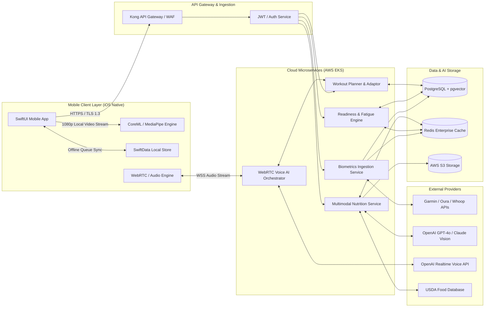

---

# Complete System Architecture Diagram

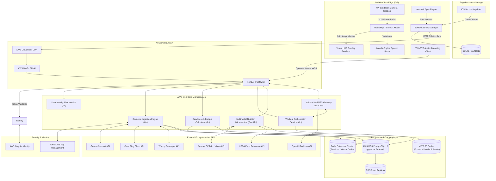

---

# Technology Stack

| Layer | Technology | Selection Justification |
| :--- | :--- | :--- |
| **Mobile Frontend** | Swift 5.10 / SwiftUI | Offers native hardware execution speeds required for AVFoundation camera pipelines and CoreML inference. |
| **On-Device CV** | MediaPipe / CoreML | Executes 33-keypoint 3D skeletal detection within 12ms on Apple Silicon (A14 Bionic or newer). |
| **Edge Storage** | SwiftData / SQLite | Native persistence layer supporting offline-first transactions and conflict-free sync algorithms. |
| **API Gateway** | Kong Enterprise / Envoy | Provides rate limiting, dynamic routing, WAF protection, and low-latency proxy operations. |
| **Core Microservices** | Go (Golang 1.22) | High-concurrency runtime with low memory footprint for routing, auth, telemetry processing, and business workflows. |
| **ML Microservices** | Python 3.11 / FastAPI | High ecosystem alignment for ML pipelines, Pydantic data validation, dynamic vision processing, and vector formatting. |
| **Primary Database** | AWS RDS PostgreSQL 15 | Provides transactional ACID consistency combined with `pgvector` for semantic food/exercise embedding search. |
| **Caching & Queues** | Redis Enterprise Cluster | Delivers sub-millisecond retrieval of user session states, rate limits, transient biometrics, and semantic prompt caches. |
| **Voice Streaming** | WebRTC / WebSockets (Opus) | Sub-100ms transport layer latency for audio frames between mobile clients and voice processing nodes. |
| **AI / Multimodal** | OpenAI GPT-4o & Realtime API | High-accuracy visual component decomposition and low-latency speech-to-speech audio interaction. |
| **Containerization** | Docker / Kubernetes (AWS EKS) | Industry-standard deployment, autoscaling, and zero-downtime rolling updates. |
| **IaC & CI/CD** | Terraform / GitHub Actions | Declarative infrastructure management and automated deployment pipelines with static code analysis. |
| **Observability** | Datadog + Sentry | End-to-end APM tracing, real-time logging, custom performance dashboards, and crash collection. |

---

# Project Folder Structure

```
aurafit-ai/
├── .github/
│   └── workflows/
│       ├── ios-ci.yml
│       ├── backend-ci.yml
│       └── terraform-deploy.yml
├── mobile-ios/
│   ├── AuraFitApp.swift
│   ├── App/
│   │   ├── Navigation/
│   │   └── DIContainer.swift
│   ├── Core/
│   │   ├── Camera/
│   │   │   ├── FrameBufferCapturer.swift
│   │   │   └── CameraHUDOverlay.swift
│   │   ├── ComputerVision/
│   │   │   ├── PoseEstimator.swift
│   │   │   ├── BiomechanicalRules.swift
│   │   │   └── KeypointVectorCalculator.swift
│   │   ├── Health/
│   │   │   ├── HealthKitManager.swift
│   │   │   └── BiometricNormalizer.swift
│   │   ├── Network/
│   │   │   ├── APIClient.swift
│   │   │   ├── WebSocketManager.swift
│   │   │   └── WebRTCVoiceClient.swift
│   │   └── Storage/
│   │       ├── SwiftDataStack.swift
│   │       └── OfflineSyncEngine.swift
│   ├── Features/
│   │   ├── Readiness/
│   │   ├── Workout/
│   │   ├── Nutrition/
│   │   └── Profile/
│   └── Shared/
│       └── UIComponents/
├── backend-go/
│   ├── cmd/
│   │   ├── api-gateway/
│   │   ├── biometrics-service/
│   │   └── workout-service/
│   ├── internal/
│   │   ├── domain/
│   │   ├── repository/
│   │   ├── service/
│   │   ├── transport/
│   │   │   ├── http/
│   │   │   └── grpc/
│   │   └── middleware/
│   ├── pkg/
│   │   ├── telemetry/
│   │   ├── crypto/
│   │   └── logger/
│   ├── go.mod
│   └── Dockerfile
├── backend-fastapi-ml/
│   ├── app/
│   │   ├── api/
│   │   │   └── v1/
│   │   │       ├── vision_nutrition.py
│   │   │       └── embeddings.py
│   │   ├── core/
│   │   │   ├── config.py
│   │   │   └── security.py
│   │   ├── services/
│   │   │   ├── vision_llm.py
│   │   │   ├── usda_lookup.py
│   │   │   └── prompt_cache.py
│   │   └── schemas/
│   ├── requirements.txt
│   └── Dockerfile
├── terraform/
│   ├── main.tf
│   ├── variables.tf
│   ├── modules/
│   │   ├── eks/
│   │   ├── rds/
│   │   ├── redis/
│   │   └── s3/
│   └── environments/
│       ├── staging/
│       └── production/
└── docs/
    └── api/
        └── openapi.yaml
```

### Folder Architecture Justification
* `mobile-ios/Core/ComputerVision`: Encapsulates frame ingestion and keypoint vector mapping, completely isolated from network or UI layers to guarantee 30 FPS execution bounds.
* `backend-go/internal`: Strictly enforces Clean Architecture boundaries (`domain` $\rightarrow$ `service` $\rightarrow$ `repository`). Go domain logic has zero external library dependencies, keeping microservices testable and maintainable.
* `backend-fastapi-ml/app/services`: Groups AI orchestrations (GPT-4o Vision and USDA fallbacks). Dedicated Python service allows rapid deployment of updated prompt structures and vector calculations independently of core Go services.
* `terraform/modules`: Modularizes infrastructure blueprints for repeatability across multi-region staging and production EKS clusters.

---

# Frontend Architecture

The iOS architecture follows the **MVVM-C (Model-View-ViewModel-Coordinator)** pattern combined with an offline-first state repository powered by SwiftData.

```mermaid
component
    package "iOS Client Architecture" {
        [SwiftUI Views Layer] --> [Coordinator Layer]
        [Coordinator Layer] --> [ViewModels (State/UI)]
        [ViewModels (State/UI)] --> [Domain Service Interfaces]
        
        subgraph Core Engines
            [Domain Service Interfaces] --> [HealthKit Ingestion Engine]
            [Domain Service Interfaces] --> [CoreML Pose Estimator]
            [Domain Service Interfaces] --> [WebRTC Voice Client]
            [Domain Service Interfaces] --> [Offline Sync Manager]
        end

        subgraph Storage & Hardware
            [CoreML Pose Estimator] --> [AVFoundation Camera]
            [Offline Sync Manager] --> [SwiftData SQLite DB]
            [HealthKit Ingestion Engine] --> [Apple HealthKit]
        end
    }
```

### Pages, Components & ViewModels
* **Readiness Dashboard View:** Consumes `ReadinessViewModel`. Displays wake-up fatigue index, sleep score cards, HRV trend charts, and recommended dynamic routine adjustments.
* **Camera Workout Session View:** Houses `AVCaptureSession` visual pipeline, `CameraHUDOverlay` view, and `PoseEstimationViewModel`. Directs 30 FPS buffer stream to CoreML without causing main-thread SwiftUI re-renders.
* **Photo Nutrition View:** Manages food photo capture via `NutritionViewModel`. Renders structured response UI with interactive macro sliders for manual user override.

### Computer Vision Frame Pipeline
1. `FrameBufferCapturer` intercepts `CVPixelBuffer` frames from `AVCaptureVideoDataOutput` at 1080p @ 30 FPS.
2. Pixel buffer is passed to `PoseEstimator` via CoreML (`MediaPipePoseLandmarker.mlmodel`).
3. CoreML returns 33 skeletal keypoints in normalized 3D space ($x, y, z, \text{confidence}$).
4. `BiomechanicalRules` calculates angular vectors (e.g., $\theta_{\text{knee}} = \arccos\left(\frac{\mathbf{v}_1 \cdot \mathbf{v}_2}{\|\mathbf{v}_1\| \|\mathbf{v}_2\|}\right)$).
5. If $\theta_{\text{knee}} < \text{Threshold}$ for Knee Valgus, a trigger sends localized visual state updates to `CameraHUDOverlay` (red highlight) and enqueues audio speech synthesis within $< 300\text{ms}$.

### Offline Sync Engine
* All user actions (completed reps, sets, macro logs) are written to local `SwiftData` context using append-only transaction instances tagged with a UUID and millisecond timestamp.
* `OfflineSyncEngine` monitors continuous network reachability via `NWPathMonitor`.
* Upon network reconnection, local queues flush to `/api/v1/sync` using bulk operations. Server reconciliation utilizes idempotentupserts to merge datasets safely.

---

# Backend Architecture

The cloud backend uses a microservices architecture implemented in Go and FastAPI, orchestrated via AWS EKS and Kong API Gateway.

```mermaid
component
    package "Backend Service Topology" {
        [Kong Gateway] --> [Go Core Microservice]
        [Kong Gateway] --> [FastAPI ML Microservice]
        [Kong Gateway] --> [Voice WebRTC Gateway]

        subgraph Go Core Architecture
            [Go Core Microservice] --> [HTTP/gRPC Controllers]
            [HTTP/gRPC Controllers] --> [Business Logic Services]
            [Business Logic Services] --> [Data Repositories]
            [Data Repositories] --> [(PostgreSQL / pgvector)]
            [Business Logic Services] --> [(Redis Enterprise Cache)]
        end

        subgraph FastAPI Architecture
            [FastAPI ML Microservice] --> [Vision Processing Controller]
            [Vision Processing Controller] --> [OpenAI GPT-4o Client]
            [Vision Processing Controller] --> [USDA Lookup Engine]
            [Vision Processing Controller] --> [Prompt Vector Cache]
        end
    }
```

### Go Core Architecture (Clean Architecture Pattern)
* **Controller Layer:** Parses HTTP/gRPC requests, validates JSON/protobuf contracts, and maps payload attributes.
* **Service Layer:** Executes core domain algorithms including dynamic workout re-indexing, fatigue score weighting, and wearable token refreshes.
* **Repository Layer:** Encapsulates raw database SQL queries using `pgx` pool with full support for `pgvector` operations.
* **Database Isolation:** Database mutations execute within managed PostgreSQL transactions (`BEGIN ... COMMIT`) ensuring data integrity across user records.

---

# Authentication Flow

AuraFit AI uses OAuth 2.0 with JSON Web Tokens (JWT). Mobile clients authenticate using Sign in with Apple or OAuth credentials to receive short-lived Access Tokens (15-minute expiration) and long-lived Refresh Tokens (30-day expiration).

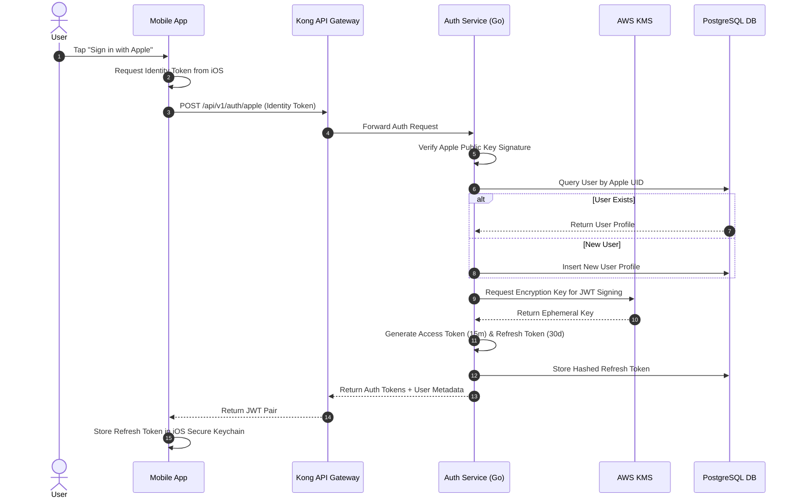

---

# Authorization

System permissions are enforced via Role-Based Access Control (RBAC) middleware integrated into the Kong Gateway and backed by standard JWT claims.

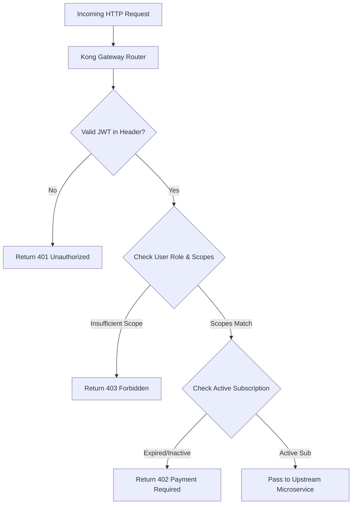

### Role Matrix

| Role | Permissions & Access Boundaries |
| :--- | :--- |
| `anonymous` | Access restricted to public auth routes (`/auth/login`, `/auth/apple`, `/healthz`). |
| `user_free` | Read-only access to basic workout library and limited daily meal scans (3/day). |
| `user_premium` | Full access to real-time CV form analysis, Unlimited Photo-to-Macro AI, WebRTC Voice, and Fatigue adaptors. |
| `admin` | Full administrative API system access, user management, telemetry overrides, and operational analytics. |

---

# Database Design

The relational structure runs on AWS RDS PostgreSQL 15, extended with the `pgvector` extension for semantic vector similarity matching.

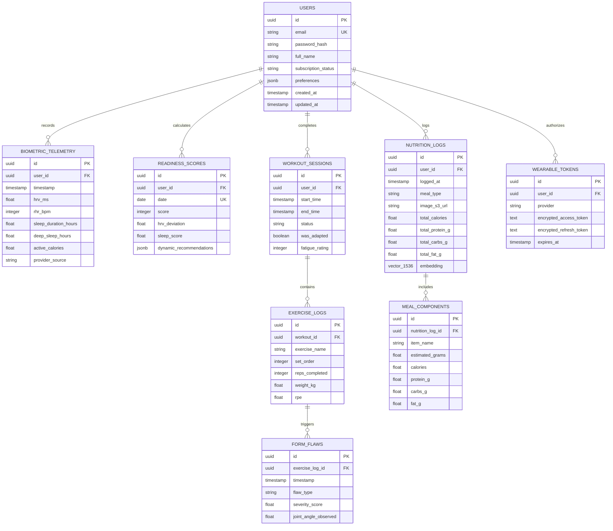

---

# Data Flow

### Photo-to-Macro Pipeline Lifecycle
1. User captures meal photograph within the iOS mobile app.
2. Native client resizes image to $1024 \times 1024$ pixels (JPEG 85% compression) and requests presigned upload URL from `/api/v1/nutrition/upload-url`.
3. Client uploads compressed image directly to AWS S3, then calls `/api/v1/nutrition/photo-log` with the object reference key.
4. FastAPI ML Service computes an image embedding and queries the Redis vector cache. If a high-confidence match ($>0.95$ cosine similarity) is found, cached macros are returned immediately.
5. On cache miss, image payload routes to OpenAI GPT-4o Vision API with a strict Pydantic structured output schema.
6. Identified ingredients are verified against the USDA database for mass-to-calorie validation.
7. Consolidated meal entity persists to PostgreSQL and updates user daily macros in Redis before returning response payload to mobile client.

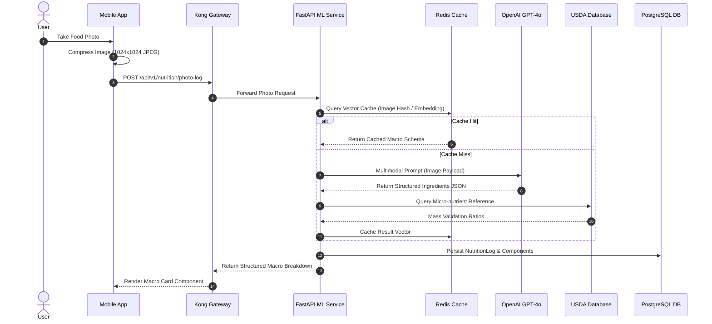

---

# API Architecture

### Primary REST API Endpoints

| Endpoint | Method | Auth | Scope | Description |
| :--- | :--- | :--- | :--- | :--- |
| `/api/v1/auth/apple` | `POST` | Public | None | Authenticates user via Apple Sign-In ID Token. |
| `/api/v1/auth/refresh` | `POST` | Public | None | Exchanges valid Refresh Token for new Access Token. |
| `/api/v1/biometrics/sync` | `POST` | Bearer | `user_free` | Bulk syncs normalized biometric samples from mobile client. |
| `/api/v1/readiness/today` | `GET` | Bearer | `user_free` | Fetches morning readiness score, metrics breakdown, and adaptation triggers. |
| `/api/v1/workouts/next` | `GET` | Bearer | `user_premium` | Generates or fetches dynamically recalibrated workout routine. |
| `/api/v1/workouts/session` | `POST` | Bearer | `user_premium` | Logs finished workout session, completed reps, and form flaw summary. |
| `/api/v1/nutrition/photo-log` | `POST` | Bearer | `user_premium` | Processes food photo, executes vision breakdown, and returns parsed macros. |
| `/ws/v1/voice-coach` | `WS` | Bearer | `user_premium` | Establishes full-duplex WebSocket audio session for intra-workout coaching. |

### Standardized JSON Response Envelope
All API endpoints return JSON responses using a unified envelope structure:

```json
{
  "success": true,
  "data": {
    "readiness_score": 38,
    "status": "FATIGUED",
    "recommendation": "High acute cardiovascular strain detected. HRV down 18% below baseline. Replaced Heavy Back Squats with Active Mobility work."
  },
  "error": null,
  "meta": {
    "request_id": "req_8f920a1b4c",
    "timestamp": "2026-03-31T08:30:00Z"
  }
}
```

### Standardized Error Format
```json
{
  "success": false,
  "data": null,
  "error": {
    "code": "BIOMETRIC_SYNC_TIMEOUT",
    "message": "Failed to synchronize telemetry payload with third-party endpoint.",
    "details": [
      {
        "field": "garmin_token",
        "issue": "OAuth token expired and refresh request timed out."
      }
    ]
  },
  "meta": {
    "request_id": "req_99c301a2d1",
    "timestamp": "2026-03-31T08:31:05Z"
  }
}
```

---

# API Request Lifecycle

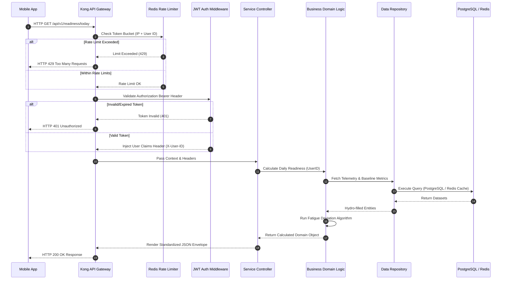

---

# State Management

The iOS native client implements a centralized state management framework that combines SwiftUI `@Observable` state engines with local persistent transaction logging.

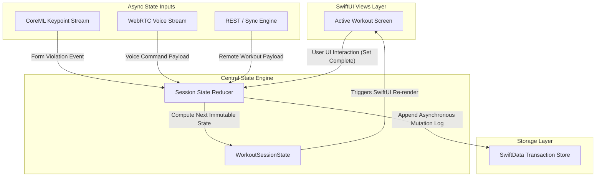

---

# External Integrations

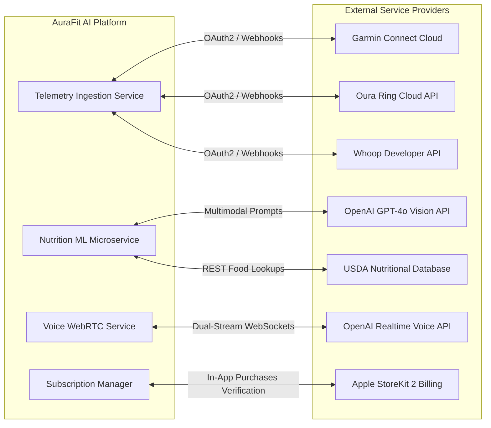

---

# Deployment Architecture

The system is deployed on AWS using EKS (Elastic Kubernetes Service) spanning multiple Availability Zones (AZs) for high availability and automated failover.

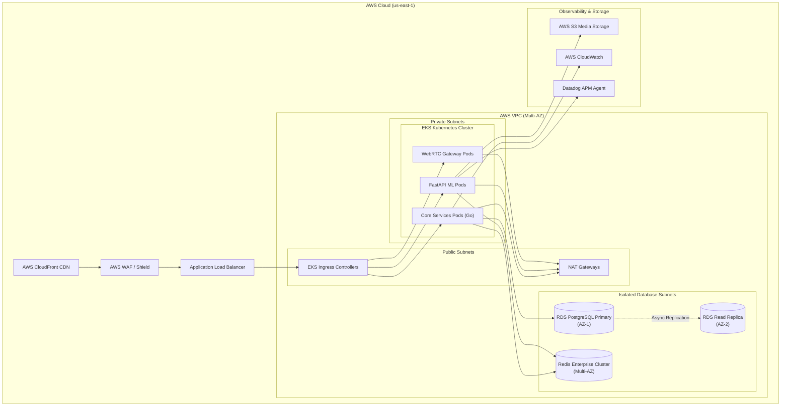

---

# CI/CD Pipeline

Continuous Integration and Continuous Deployment are managed via GitHub Actions, enforcing strict static code analysis, unit testing thresholds, automated infrastructure validation via Terraform, and zero-downtime rolling canary deployments on Kubernetes.

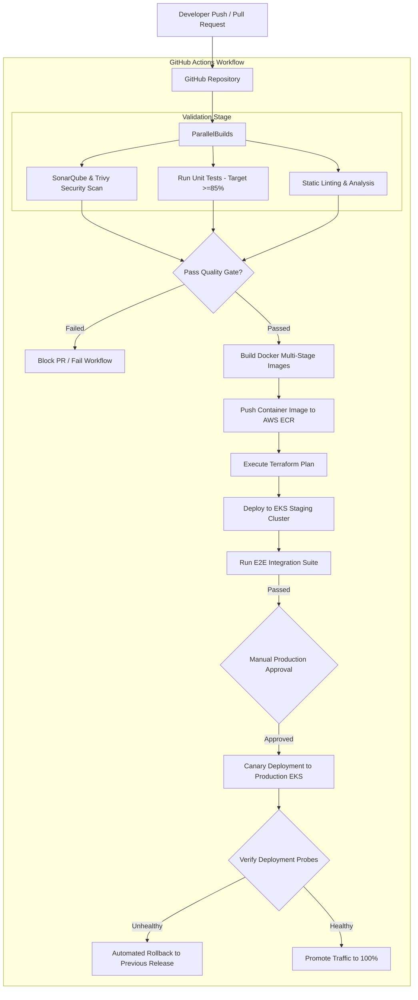

---

# Security Architecture

Security is implemented using a defense-in-depth approach across all layers of the platform, enforcing strict zero-trust parameters, encryption standards, and automated HIPAA compliance isolation.

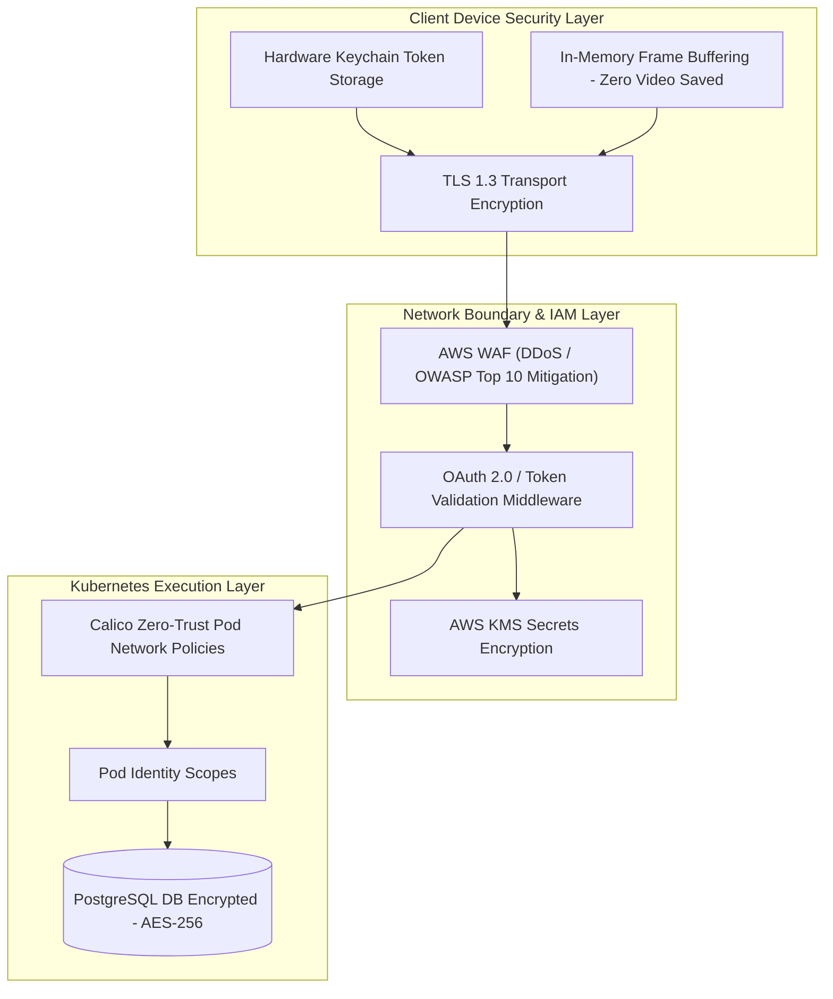

### Key Security Controls
* **Zero Video Retention:** Mobile applications process video buffers exclusively in volatile memory (`CVPixelBuffer`). No raw video frames are saved to local device disk storage or transmitted over network interfaces.
* **PII & Telemetry Anonymization:** Biometric records stored in PostgreSQL use internal pseudo-anonymous UUID identifiers decoupled from user identity details.
* **Encryption Standards:** Database tables, Redis cache buffers, and S3 objects are encrypted at rest using AES-256 managed through AWS KMS key rotations.
* **Data Erasure Compliance:** Automated single-click user profile purge features execute hard deletions across PostgreSQL, Redis, and S3 within 24 hours to comply with GDPR/CCPA regulations.

---

# Performance Optimization

1. **On-Device Quantized Pose Estimation:** Keypoint estimation runs locally via CoreML using FP16 quantization. This achieves 30 FPS on Apple A14 Bionic hardware or newer, requiring $\le 33\text{ms}$ per frame while minimizing hardware thermal throttling.
2. **Redis Semantic Prompt Caching:** Meal identification requests execute vector search checks against Redis Enterprise using image hash vectors. Identical or high-similarity meal photo scans serve cached nutrition profiles, skipping LLM vision calls and reducing token costs by up to 60%.
3. **Database Indexing Strategy:** Heavy relational tables (`biometric_telemetry`, `exercise_logs`) use composite indexes on `(user_id, timestamp)`. `pgvector` nutrition columns utilize **HNSW (Hierarchical Navigable Small World)** indexing for sub-10ms vector searches.
4. **Binary Audio Transport:** Voice streams utilize the **Opus audio codec** encapsulated in lightweight WebSockets/WebRTC datagrams. Audio buffers are downsampled to 16kHz mono, reducing network payload sizes by 80% relative to uncompressed WAV formats.

---

# Scalability

The platform leverages horizontal autoscaling across all cloud tiers to manage sudden traffic spikes during morning user wake-up windows and peak exercise hours.

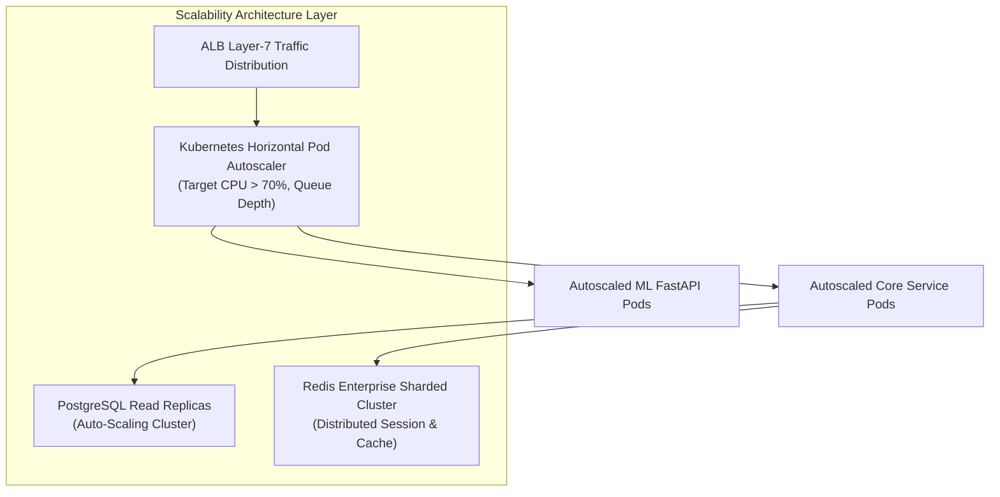

### Auto-Scaling Rules & Thresholds
* **EKS Compute Pods:** Kubernetes Horizontal Pod Autoscalers (HPA) scale Go and FastAPI service replicas dynamically based on target CPU usage ($>70\%$) and HTTP request queue length.
* **Database Scaling:** PostgreSQL queries split read and write operations. High-volume read endpoints target auto-scaled RDS Read Replicas, isolating the primary node for ACID database mutations.
* **Telemetry Decoupling:** Ingested wearable telemetry is buffered directly into AWS SQS message queues to smooth out sudden write bursts before processing by backend services.

---

# Monitoring & Observability

Observability is maintained through Datadog, CloudWatch, and Sentry, providing complete visibility across key system health metrics.

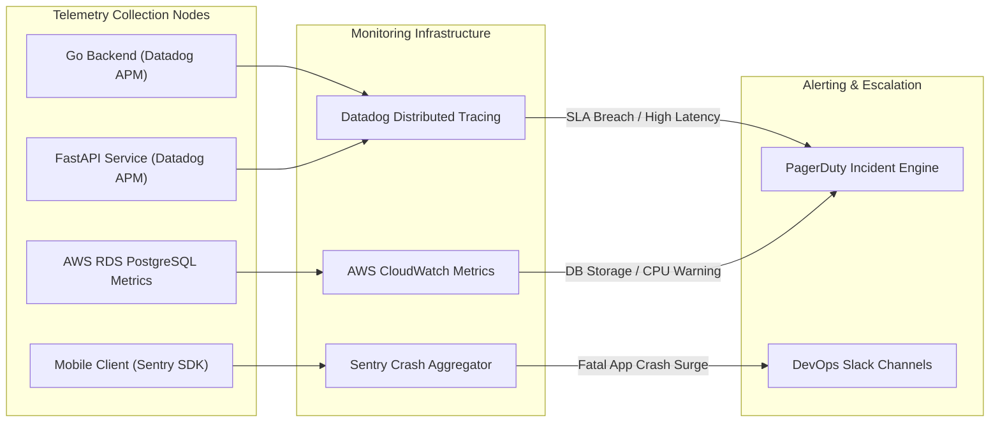

### Critical Health Probes & Alerts
* **CV Feedback SLA:** PagerDuty trigger if on-device HUD rendering latency exceeds 300ms on active client sessions.
* **Voice AI Latency:** Alert if WebRTC audio speech response roundtrip latency exceeds 600ms across 5% of requests over a rolling 5-minute window.
* **API Error Rate:** PagerDuty escalation if HTTP 5xx backend error rates exceed 1% over a 5-minute window.

---

# Disaster Recovery

### Recovery Metrics
* **Recovery Point Objective (RPO):** $< 5 \text{ minutes}$ (continuous PostgreSQL Write-Ahead Logging to S3).
* **Recovery Time Objective (RTO):** $< 15 \text{ minutes}$ (automated multi-AZ failover and standby environment provisioning).

### Backup & Failover Procedures
* **Database PITR:** AWS RDS PostgreSQL is configured with multi-AZ replication and automated point-in-time recovery (PITR) with continuous WAL archiving.
* **Automated Failover:** If the primary PostgreSQL instance experiences hardware or availability zone failure, RDS automatically promotes the standby replica to primary within 60 seconds.
* **Cloud Infrastructure Recovery:** Infrastructure is defined declaratively using Terraform. In the event of a catastrophic regional failure, CI/CD pipelines can deploy the complete platform stack into an alternative AWS region within 15 minutes.

---

# Testing Strategy

```
+-----------------------------------------------------------------------+
|                       TESTING PYRAMID TOPOLOGY                        |
|                                                                       |
|                          /  End-to-End  \                             |
|                         /   (XCTest UI)  \                            |
|                        --------------------                           |
|                       /  Integration Tests \                          |
|                      / (API / Mock Webhooks)\                         |
|                     --------------------------                        |
|                    /        Unit Tests        \                       |
|                   /  (Go, Swift, Python Core)  \                      |
+-----------------------------------------------------------------------+
```

### 1. Unit Testing ($\ge 85\%$ Target Coverage)
* **Go Core Services:** Native `testing` package validating domain algorithm business logic, fatigue math, and repository mocks.
* **iOS Native App:** XCTest suites verifying view models, biomechanical vector angle calculations, and local SwiftData model mutations.

### 2. Integration Testing ($\ge 80\%$ Target Coverage)
* Containerized integration test runs using `testcontainers-go` to run real PostgreSQL and Redis instances during local and CI test passes.
* Validation of third-party wearable webhook normalization logic using simulated JSON payloads.

### 3. Load & Stress Simulation
* K6/Locust load testing suites simulating 100,000 Concurrent Active Users (CAU) issuing parallel API telemetry sync calls, workout recalibrations, and photo scans.

---

# Risks & Challenges

| Risk Description | Severity / Probability | Mitigation Strategy |
| :--- | :--- | :--- |
| **Legal & Injury Liability Claims** | High / Medium | Enforce strict in-app waivers; restrict LLM guardrails from providing medical advice; hardcode safety boundary rules. |
| **Cloud Token Cost Explosion** | High / High | Perform 100% of computer vision pose processing on-device; leverage prompt caching; route standard queries to SLMs. |
| **Real-time Audio Jitter & Latency** | High / Medium | Utilize WebRTC and Opus compression; deploy Voice AI Gateway nodes at network edges close to core user clusters. |
| **Mobile Thermal Throttling** | Medium / Medium | Quantize CoreML ML models to FP16; run pose estimation frame calculations at target 30 FPS rather than native 60/120 FPS. |
| **Wearable API Rate Limiting** | Medium / High | Implement exponential backoff retry queues; isolate external API calls via asynchronous worker threads. |

---

# Future Enhancements

1. **Fully On-Device Edge LLM Integration:** Transition text and workout dynamic adjustment capabilities to localized Small Language Models (e.g., fine-tuned Llama 3 / Phi-3) executing on the Apple Neural Engine, enabling full functionality offline.
2. **tvOS & Smart Mirror Companion App:** Extend on-device CoreML pose tracking to Apple TV and external display hardware, supporting multi-camera setups for home fitness environments.
3. **Continuous Glucose Monitor (CGM) Sync:** Ingest real-time blood glucose data to correlate metabolic spikes and crashes with daily fatigue, exercise performance, and meal composition.
4. **Personalized Biomechanical Rule Personalization:** Utilize federated learning techniques to customize joint angle violation thresholds based on individual user limb lengths and mobility constraints.

---

# Final Architecture Summary

The AuraFit AI technical architecture provides a secure, low-latency foundation optimized for intelligent physical coaching and health metrics processing.

```
+-----------------------------------------------------------------------------------+
|                            AURAFIT AI ARCHITECTURE MAP                            |
|                                                                                   |
|   MOBILE EDGE (iOS Native)             CLOUD PLATFORM (AWS EKS & Go/FastAPI)      |
|  +--------------------------+         +---------------------------------------+  |
|  | - CoreML Pose (30 FPS)   |         | - Kong API Gateway / WAF              |  |
|  | - Visual HUD Overlay     |  HTTPS  | - Go Microservices (Clean Arch)       |  |
|  | - WebRTC Audio Client    |<=======>| - FastAPI Multimodal Vision Pipeline  |  |
|  | - SwiftData Store        |  WSS    | - PostgreSQL 15 + pgvector Database   |  |
|  | - HealthKit Sync Engine  |         | - Redis Enterprise Caching Cluster    |  |
|  +--------------------------+         +---------------------------------------+  |
+-----------------------------------------------------------------------------------+
```

By using on-device CoreML and MediaPipe pipelines for frame processing, the application achieves a **$<300\text{ms}$ visual feedback loop** while keeping raw video data private and maintaining gross margins above 80%. Cloud microservices built in Go and FastAPI provide scalable processing for wearable telemetry, daily fatigue scoring, and multimodal photo nutrition lookups.

The infrastructure scales across multiple Availability Zones on AWS EKS, protected by Kong WAF security boundaries and encrypted database layers. Resilient offline synchronization ensures that fitness enthusiasts can record workouts reliably in any network environment, creating a robust, high-performance platform for health and athletic performance.
